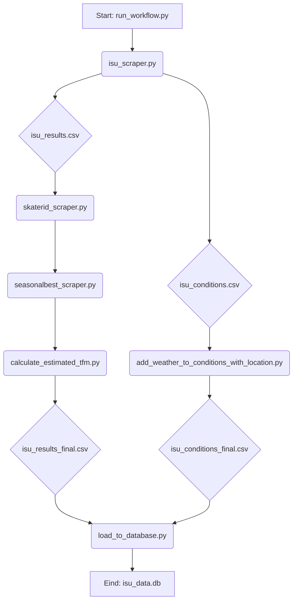

# Technisch Ontwerp – ISU Data Pipeline
 
## Inhoud
- Inleiding
- Systeemarchitectuur
- Componentenbeschrijving
- Datamodel
- Afhankelijkheden en Omgeving
- Logging en Foutafhandeling
- Inzet van AI-Assistentie

---

## 1. Inleiding

### 1.1 Doel van het Document
Dit document levert een gedetailleerde technische beschrijving van de ISU Data Pipeline. Waar het Functioneel Ontwerp (FO) beschrijft *wat* het systeem doet, richt dit Technisch Ontwerp (TO) zich op *hoe* die functionaliteit is gerealiseerd. Het is opgesteld als een essentiële handleiding voor ontwikkelaars, software-architecten en technisch beheerders die de software in de toekomst moeten onderhouden, uitbreiden of debuggen.

Het TO behandelt de systeemarchitectuur, de specifieke implementatie van elke softwarecomponent, het datamodel, en de strategieën voor foutafhandeling en logging. Alle technische keuzes, zoals de selectie van programmeertalen, libraries en algoritmes, worden in dit document onderbouwd.

### 1.2 Verwijzing naar Functioneel Ontwerp
Dit document is de technische tegenhanger van het "Functioneel Ontwerp – ISU Data Pipeline". Alle in dit document beschreven technische componenten zijn ontwikkeld om te voldoen aan de functionele eisen en doelen die in het FO zijn vastgelegd. Voor een volledig beeld van het project dienen beide documenten in samenhang te worden gelezen.

---

## 2. Systeemarchitectuur

### 2.1 Overzicht
De ISU Data Pipeline is ontworpen als een klassiek, robuust ETL (Extract, Transform, Load) proces. De architectuur is gebaseerd op een reeks van modulaire en onafhankelijke Python-scripts, waarbij elk script verantwoordelijk is voor één specifieke taak binnen de workflow. Deze modulaire opzet garandeert dat de stappen afzonderlijk kunnen worden getest, onderhouden en indien nodig zelfs vervangen, zonder de rest van de pipeline te beïnvloeden.

De workflow wordt aangestuurd door een centraal orkestratiescript, `run_workflow.py`, dat elke stap strikt sequentieel aanroept. Dit zorgt voor een voorspelbare en controleerbare dataflow. De data wordt na elke belangrijke transformatiestap bewust gepersisteerd naar de harde schijf in de vorm van CSV-bestanden. Deze CSV's fungeren als tussenliggende *staging area*, wat debuggen aanzienlijk vereenvoudigt: na elke stap kan de data handmatig worden geïnspecteerd.

Het eindproduct van de pipeline is geen CSV-bestand, maar een gestructureerde, draagbare en analyse-klare SQLite database (`isu_data.db`).

De belangrijkste kenmerken van de architectuur zijn:
•	**Modulariteit**: Elke taak is geïsoleerd in een eigen script.
•	**Orkestratie**: Een masterscript beheert de end-to-end executie.
•	**Persistentie**: Tussentijdse resultaten worden opgeslagen, wat de traceerbaarheid verhoogt.
•	**Idempotentie**: De pipeline kan veilig meerdere keren worden uitgevoerd en zal telkens hetzelfde, schone eindresultaat opleveren door bestaande data te overschrijven.

### 2.2 Data Flow Diagram
De datastroom is lineair en volgt de stappen die zijn gedefinieerd in het orkestratiescript.

---

## 3. Componentenbeschrijving

### 3.1 `run_workflow.py`
*   **Rol**: Orkestratie (Master Script).
*   **Techniek**: Dit script fungeert als de "dirigent" van de pipeline. Het definieert de volgorde van de uit te voeren taken in een `scripts` dictionary, wat de workflow expliciet en eenvoudig aanpasbaar maakt.
*   **Implementatie**: Het maakt gebruik van de `subprocess` module van Python om elk script als een onafhankelijk, geïsoleerd proces aan te roepen. De `subprocess.run` functie wordt gebruikt met `check=True`, wat ervoor zorgt dat het script onmiddellijk stopt en een `CalledProcessError` genereert als een van de onderliggende scripts faalt (d.w.z. een exit code anders dan 0 retourneert).
*   **Logging**: `stdout` en `stderr` van elk aangeroepen script worden opgevangen en doorgestuurd naar een centraal logbestand (`logs/workflow.log`) en de console, wat centraal debuggen mogelijk maakt.

### 3.2 `isu_scraper.py`
*   **Rol**: Extractie (Fase 1).
*   **Techniek**: De primaire bottleneck bij het scrapen is I/O-wachttijd op de API. Dit wordt geoptimaliseerd door het gebruik van concurrency.
*   **Implementatie**:
    *   **Concurrency**: Gebruikt `concurrent.futures.ThreadPoolExecutor` om meerdere API-requests parallel uit te voeren. Dit reduceert de totale doorlooptijd drastisch.
    *   **Connection Pooling**: Een `requests.Session` object wordt gebruikt voor alle API-calls. Dit hergebruikt de onderliggende TCP-verbindingen, wat de overhead van de TLS-handshake voor elke request elimineert.
    *   **Foutafhandeling**: Een `safe_get_json` wrapper-functie implementeert een *retry*-mechanisme met *exponential backoff* om met tijdelijke netwerkfouten of rate-limiting om te gaan.

### 3.3 `skaterid_scraper.py`
*   **Rol**: Transformatie - Verrijking met unieke ID's.
*   **Techniek**: Dit script lost de entiteitsresolutie op voor schaatsers door een externe API aan te roepen. Efficiëntie is hier cruciaal om te voorkomen dat tienduizenden API-calls worden gedaan.
*   **Implementatie**:
    *   **Deduplicatie**: Voordat er een API-call wordt gedaan, wordt de input-CSV gescand op unieke `(Name, Country)`-combinaties. Het API-zoekproces wordt alleen voor deze unieke set uitgevoerd.
    *   **Fuzzy Matching**: Na een API-zoekopdracht op achternaam, worden de resultaten gevalideerd met `difflib.SequenceMatcher`. Een match wordt alleen geaccepteerd bij een hoge (>0.9) similariteit van de voornaam, wat de kans op false positives minimaliseert.
    *   **Caching**: `functools.lru_cache` wordt gebruikt om de resultaten van API-calls en de normalisatie van namen te cachen, wat de performance verder verbetert als dezelfde data vaker voorkomt.

### 3.4 `seasonalbest_scraper.py`
*   **Rol**: Transformatie - Verrijking met prestatie-baselines.
*   **Techniek**: Gebruikt de zojuist toegevoegde `SkaterID` om contextuele data te verzamelen.
*   **Implementatie**:
    *   **API-gebruik**: Voor elke wedstrijdrit wordt op basis van de datum het vorige seizoen bepaald. Vervolgens wordt een gerichte API-call gedaan naar `speedskatingresults.com` met de `SkaterID` en het seizoen om de beste tijden op te halen.
    *   **Tijdconversie**: De API retourneert tijden in diverse string-formaten ("36,07", "1.11,55"). Een `time_to_seconds` functie parseert deze formaten robuust naar een genormaliseerde float-waarde in seconden.
    *   **Prestatie**: Maakt eveneens gebruik van een `ThreadPoolExecutor` om de API-calls parallel uit te voeren.

### 3.5 `add_weather_to_conditions_with_location.py`
*   **Rol**: Transformatie - Verrijking met externe weersomstandigheden.
*   **Techniek**: De Open-Meteo API is minder tolerant voor grote, parallelle requests. Daarom is hier een meer defensieve, sequentiële strategie gekozen.
*   **Implementatie**:
    *   **Batching per Jaar**: In plaats van alle data voor een locatie in één keer op te vragen, groepeert het script de benodigde data per locatie per jaar. Het doet een kleine, gerichte request voor één jaar, wacht een seconde (`time.sleep(1)`), en doet dan pas de request voor het volgende jaar. Dit omzeilt de rate-limiting van de API effectief.

### 3.6 `calculate_estimated_tfm.py`
*   **Rol**: Transformatie - Berekenen van afgeleide metrieken.
*   **Techniek**: Implementeert de gedefinieerde businesslogica.
*   **Implementatie**:
    *   **Interval Mapping**: De intervallen per afstand zijn vastgelegd in een `INTERVAL_MAPPING` dictionary, wat de logica overzichtelijk en eenvoudig aanpasbaar maakt.
    *   **Speciale Logica 10.000m**: Het script groepeert alle ritten per 10km-wedstrijd, telt het aantal unieke paren en bepaalt of de "dweilpauze-reset" moet worden toegepast. Dit is een goed voorbeeld van domeinspecifieke kennis die in code is vastgelegd.

### 3.7 `load_to_database.py`
*   **Rol**: Load (Fase 3).
*   **Techniek**: Laadt de finale CSV-bestanden in een relationele database.
*   **Implementatie**:
    *   **SQLite**: Gebruikt Python's ingebouwde `sqlite3` module. De keuze voor SQLite maakt de database extreem portable (één `.db`-bestand) en elimineert de noodzaak voor een externe databaseserver.
    *   **Idempotentie**: Voert een `DROP TABLE IF EXISTS` uit voordat de data wordt geladen. Dit zorgt ervoor dat elke uitvoering van de pipeline start met een schone database, wat voorspelbare resultaten garandeert.
    *   **Dynamisch Schema**: De tabel- en kolomnamen worden niet hardgecodeerd. Het script leest de header van het CSV-bestand, maakt de kolomnamen SQL-veilig (verwijdert spaties, etc.) en bouwt dynamisch de `CREATE TABLE` en `INSERT` statements op.

---

## 4. Datamodel

De uiteindelijke data wordt opgeslagen in een SQLite database (`isu_data.db`) met twee tabellen: `results` en `conditions`.

### `results` tabel
| Kolomnaam | Type | Beschrijving |
|---|---|---|
| STADIUM | TEXT | Unieke, opgeschoonde naam van de ijsbaan. |
| DATE | TEXT | Datum van de wedstrijd (YYYY-MM-DD). |
| EVENT | TEXT | Naam van het overkoepelende evenement (bv. ISU_World_Cup). |
| RACE | TEXT | Naam van de specifieke afstand (bv. 500m_Women). |
| RANK | TEXT | Eindklassering van de schaatser. |
| NR | TEXT | Startnummer van de schaatser. |
| NAME | TEXT | Volledige naam van de schaatser (Given_Family). |
| COUNTRY | TEXT | Drieletterige landcode. |
| PAIR | TEXT | Startpaar van de schaatser. |
| LANE | TEXT | Startbaan (I voor Inner, O voor Outer). |
| TIME | TEXT | Gereden eindtijd. |
| BEHIND | TEXT | Tijd achter de winnaar. |
| GENDER | TEXT | Geslacht (Women/Men). |
| SKATERID | TEXT | Unieke, numerieke ID van de schaatser. |
| SEASONALBEST | TEXT | Beste tijd van de schaatser op deze afstand in het voorgaande seizoen. |
| ESTIMATEDTFM | TEXT | Geschatte tijd in seconden sinds de laatste ijspreparatie. |
| ESTIMATEDTFMBUFFER | TEXT | TFM plus een standaard buffer van 60 seconden. |

### `conditions` tabel
| Kolomnaam | Type | Beschrijving |
|---|---|---|
| STADIUM | TEXT | Unieke, opgeschoonde naam van de ijsbaan. |
| DATE | TEXT | Datum van de meting (YYYY-MM-DD). |
| EVENT | TEXT | Naam van het overkoepelende evenement. |
| RACE | TEXT | Naam van de specifieke afstand. |
| COUNTRY | TEXT | Drieletterige landcode van het evenement. |
| DISTANCE | TEXT | Afstand in meters. |
| OCCASION | TEXT | Meetmoment (bv. start, end, cleaning). |
| TIME | TEXT | Tijdstip van de meting (HH:MM:SS). |
| TEMPINDOORS | TEXT | Luchttemperatuur in de hal (°C). |
| ICETEMPERATURE | TEXT | IJstemperatuur (°C). |
| HUMIDITY | TEXT | Luchtvochtigheid (%). |
| TEMPOUTDOORS | TEXT | **[Verrijkt]** Buitentemperatuur op dat uur (°C). |
| AIRPRESSURESURFACE | TEXT | **[Verrijkt]** Luchtdruk op grondniveau (hPa). |
| AIRPRESSURESEALEVEL| TEXT | **[Verrijkt]** Luchtdruk op zeeniveau (hPa). |

---

## 5. Afhankelijkheden en Omgeving
*   **Runtime**: Python 3.8+
*   **Python Libraries**:
    *   `requests`: Essentieel voor het uitvoeren van HTTP-requests naar de externe APIs.
*   **Externe Services (APIs)**:
    *   ISU Results API (`api.isuresults.eu`): Bron voor wedstrijd- en conditiedata.
    *   SpeedSkatingResults API (`speedskatingresults.com/api`): Bron voor skater ID's en seizoensbeste tijden.
    *   Open-Meteo Archive API (`archive-api.open-meteo.com`): Bron voor historische weerdata.

---

## 6. Logging en Foutafhandeling
*   **Centrale Logging**: `run_workflow.py` configureert de `logging` module om alle output (zowel naar `stdout` als `stderr`) van zichzelf en de aangeroepen subprocessen te schrijven naar `logs/workflow.log`. Dit biedt één centrale plek om de volledige executie van de pipeline te traceren.
*   **Fail-Fast Principe**: De workflow stopt onmiddellijk als een script faalt. Dit wordt afgedwongen door de `check=True` parameter in `subprocess.run`, wat een uitzondering genereert bij een non-zero exit code. Dit voorkomt dat latere stappen worden uitgevoerd met incomplete of corrupte data.
*   **Gedetailleerde Foutmeldingen**: De `try...except` blokken in zowel `run_workflow.py` als de individuele scripts zorgen ervoor dat relevante foutinformatie, zoals de specifieke `ValueError` of de `HTTPError` statuscode, wordt gelogd voordat het proces stopt.

---

## 7. Inzet van AI-Assistentie
De ontwikkeling van deze pipeline is significant versneld door de inzet van een AI-programmeerassistent (Gemini). De assistent werd ingezet voor de volgende taken:
*   **Code Generatie**: Genereren van boilerplate code voor de Python-scripts, zoals het opzetten van de `ThreadPoolExecutor`, het parsen van CSV-bestanden en het structureren van API-calls.
*   **Debugging**: Analyseren van stack traces en error logs om de hoofdoorzaak van problemen snel te identificeren, zoals de `ValueError` door incorrecte kolomnamen en de `FileNotFoundError` door inconsistente bestandspaden.
*   **Refactoring**: Voorstellen van verbeteringen, zoals het toevoegen van `os.path.join` voor het bouwen van besturingssysteem-onafhankelijke paden en het centraliseren van de output naar een `data/` directory.
*   **Documentatie**: Het genereren en structureren van de `README.md`, het Functioneel Ontwerp en dit Technisch Ontwerp op basis van de broncode en conversaties over de gewenste functionaliteit. De AI hielp bij het formuleren van heldere, gestructureerde en complete documentatie.
